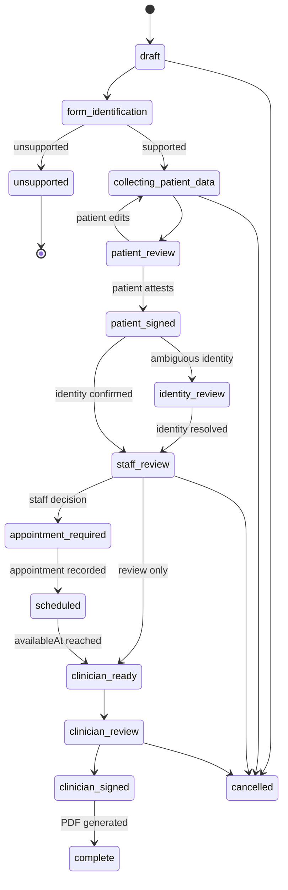

# Workflow State Machine

A state machine is simply the approved list of statuses and which moves are allowed. Keeping transitions explicit prevents a submission from being signed before review or appearing in the wrong queue.

## Submission states

| State | Meaning |
|---|---|
| `draft` | Submission exists but form is not selected |
| `form_identification` | Upload or description is being matched |
| `unsupported` | No supported template was identified |
| `collecting_patient_data` | Interview and extraction confirmation are active |
| `patient_review` | Patient can review and correct patient-owned content |
| `patient_signed` | Patient attestation snapshot exists |
| `staff_review` | Staff triage is pending or active |
| `identity_review` | Patient-chart link is ambiguous |
| `appointment_required` | Staff decided an appointment is needed |
| `scheduled` | Appointment date is recorded and clinician work is date-gated |
| `clinician_ready` | Review-only work can enter clinician queue now |
| `clinician_review` | Clinician has opened or claimed the work item |
| `clinician_signed` | Clinician attestation snapshot exists |
| `complete` | Final PDF was generated from signed snapshot |
| `cancelled` | Submission was cancelled with reason |

## Mermaid diagram



## Allowed transitions

| From | To | Actor | Required checks |
|---|---|---|---|
| `draft` | `form_identification` | Patient/system | Active organization, authenticated patient |
| `form_identification` | `collecting_patient_data` | System | Supported enabled template |
| `form_identification` | `unsupported` | System | Classification exhausted or explicit unsupported form |
| `collecting_patient_data` | `patient_review` | Patient/system | Required patient questions answered or marked unknown |
| `patient_review` | `patient_signed` | Patient | Attestation accepted, required patient fields valid |
| `patient_signed` | `staff_review` | System | Identity confirmed |
| `patient_signed` | `identity_review` | System | Ambiguous or unlinked patient |
| `identity_review` | `staff_review` | Staff | Patient link resolved |
| `staff_review` | `clinician_ready` | Staff | Review-only disposition |
| `staff_review` | `appointment_required` | Staff | Appointment-required disposition |
| `appointment_required` | `scheduled` | Staff | Appointment timestamp entered |
| `scheduled` | `clinician_ready` | System | Current time is at or after `availableAt` |
| `clinician_ready` | `clinician_review` | Clinician | User may claim/open work item |
| `clinician_review` | `clinician_signed` | Clinician | Required fields complete, conflicts acknowledged |
| `clinician_signed` | `complete` | System | PDF export succeeds |

## Transition implementation

All transitions go through one server function:

```ts
transitionSubmission({
  organizationId,
  submissionId,
  expectedVersion,
  from,
  to,
  actor,
  reason,
  metadata,
});
```

The function must:

1. Load the tenant-scoped submission in a transaction.
2. Confirm current state and optimistic version.
3. Confirm actor role and transition permission.
4. Run state-specific invariants.
5. Update status and version.
6. Create an append-only workflow event.
7. Create, update, or close work items.
8. Return the new canonical state.

## Signature invalidation transitions

Signature invalidation is not a normal status change by itself. It is a domain event that moves the submission back to the proper review state.

- Patient-scope edit after patient signing: invalidate patient and clinician signatures, return to `patient_review`.
- Clinician-scope edit after clinician signing: invalidate clinician signature, return to `clinician_review`.
- Source metadata change that does not alter signed values: retain signatures but log the event.

## Queue derivation

Do not store a free-form queue name on the submission. Derive views from work items:

- Staff queue: open staff task, `availableAt <= now`
- Clinician review queue: open clinician task, disposition `review_only`, `availableAt <= now`
- Visit today: open clinician task, disposition `appointment`, appointment date is today, `availableAt <= now`
- Future appointments: open clinician task, `availableAt > now`
