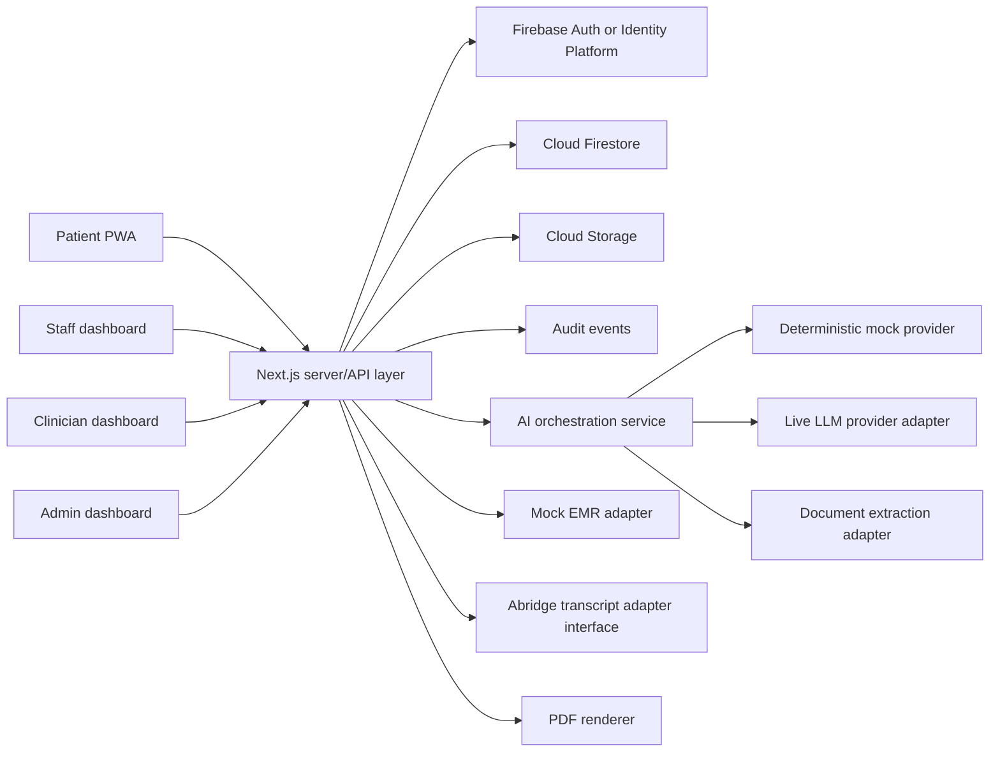

# System Architecture

## Architecture goals

- One codebase for all user roles
- Clear tenant boundary
- Deterministic workflow outside the model
- Replaceable AI, OCR, EMR, and PDF providers
- Easy local demo with emulators and fixtures
- Production path that can use contracted, eligible services

## High-level diagram



## Frontend

Use a responsive Next.js application with route groups:

- `/patient/*`
- `/staff/*`
- `/clinician/*`
- `/admin/*`

Use server-rendered authentication checks for protected pages. Client components can improve interaction, but must not be the only authorization layer.

## Backend

For the hackathon, use Next.js route handlers or server actions for application APIs. Keep business logic in framework-independent modules so it can later move to Cloud Run or Cloud Functions.

Required service modules:

- `authzService`
- `invitationService`
- `patientMatchingService`
- `submissionService`
- `workflowService`
- `formTemplateService`
- `documentService`
- `aiOrchestrator`
- `provenanceService`
- `workQueueService`
- `signatureService`
- `pdfService`
- `auditService`
- `emrAdapter`
- `transcriptAdapter`

## Data stores

### Firestore

Stores organizations, memberships, patients, templates, submissions, field values, conversations, work items, signatures, and audit events.

### Cloud Storage

Stores uploaded forms, derived page images, signature images when used, and exported PDFs. Storage object paths begin with the organization ID.

### No vector database in MVP

The form library is small. Form matching can use metadata and an LLM over enabled template summaries. A vector store adds cost, retention questions, and complexity without improving the initial demo.

## AI architecture

The application controls the sequence. The model receives narrow tasks and returns schema-validated data.

Examples:

- Classify a form request against a provided catalog
- Extract visible fields from a document
- Convert a template field into a plain-language question
- Normalize a patient answer
- Identify conflicts between two explicit statements
- Summarize operational issues for staff

The model does not receive database credentials and does not write directly to storage.

## Provider interfaces

```ts
interface LlmProvider {
  classifyForm(input: ClassifyFormInput): Promise<ClassifyFormOutput>;
  planNextQuestion(input: InterviewState): Promise<NextQuestionOutput>;
  normalizeAnswer(input: NormalizeAnswerInput): Promise<NormalizeAnswerOutput>;
  analyzeIssues(input: AnalyzeIssuesInput): Promise<AnalyzeIssuesOutput>;
}

interface DocumentExtractionProvider {
  extract(input: StoredDocumentRef): Promise<DocumentExtraction>;
}

interface EmrAdapter {
  getPatientSnapshot(ctx: TenantContext, patientId: string): Promise<EmrSnapshot>;
}

interface TranscriptAdapter {
  listEncounters(ctx: TenantContext, patientId: string): Promise<EncounterTranscript[]>;
}
```

## Synchronous and asynchronous work

Synchronous:

- Save answer
- Load next question
- Staff disposition
- Clinician field edit
- Signature validation

Asynchronous:

- Document extraction
- Form classification for uploaded files
- PDF rendering
- Optional summaries

For the hackathon, asynchronous tasks may run inline behind a loading screen, but domain status should still represent processing.

## Reliability pattern

Every live AI function has a deterministic fallback:

- Prepared classification result
- Prepared extraction fixture
- Scripted patient interview
- Prepared issue summary

A provider timeout must never corrupt the form. The user can retry or continue with manual fields.

## Production separation

A production deployment should separate:

- Public web edge
- Authenticated application API
- AI processing service
- document-processing service
- audit export

The hackathon can keep these in one project while preserving module boundaries.
